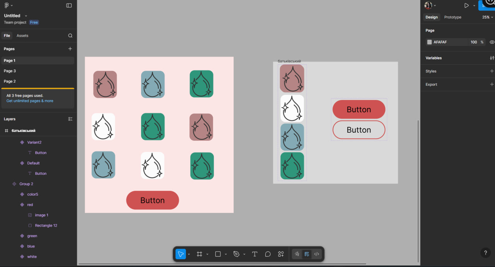

# ПЗ-10 Про компоненти і варіанти у Figma.

## Тема заняття
Робота з компонентами та варіантами у Figma. Створення компонентів, інстансів і налаштування їх властивостей.

## Мета заняття
Навчитися створювати та використовувати компоненти й варіанти у Figma для спрощення роботи з дизайном.

## Хід роботи

### 1. Робота з компонентами та варіантами у Figma

У цьому відео пояснювалося, що компоненти у Figma потрібні для того, щоб не робити одне й те саме по сто разів. Якщо в дизайні є кнопки, картки чи інші повторювані елементи, їх краще одразу робити компонентами. Тоді дизайн буде акуратніший і з ним легше працювати.

Компонент - це основний елемент, від якого потім створюються копії. Ці копії називаються інстансами. Вони виглядають так само, як і компонент, і головне - вони з ним пов’язані. Якщо змінити щось у головному компоненті, то всі інстанси автоматично оновляться.

### 2. Створення компонента

У відео показано, що будь-який елемент можна зробити компонентом — достатньо його виділити та натиснути Create Component. Після цього компонент з’являється у вкладці Assets, і його можна використовувати в будь-якому місці макета.

### 3. Інстанси та робота з ними

Інстанс — це копія компонента на макеті. У відео пояснюється, що інстанси потрібні саме для роботи: ми їх розміщуємо на екранах, міняємо текст або колір, якщо це дозволено, але саму структуру змінювати не можна.

### 4. Варіанти компонентів

У другому відео пояснюється тема Variants. Це потрібно, коли один і той самий елемент має кілька станів. Наприклад, кнопка може бути звичайною, активною, наведеною або неактивною.
Замість того щоб робити багато різних компонентів, їх об’єднують в один набір варіантів. Це зручно і набагато логічніше.

### 5. Налаштування властивостей

Було показано, як у варіантах створюються параметри, наприклад:

- стан кнопки;

- тип кнопки;

- розмір.

Після цього можна просто перемикати варіанти у панелі Properties, не створюючи нові елементи вручну. Це значно прискорює роботу.

### 6.Практичний приклад

У відео на прикладі кнопок показано, як з одного компонента зробити кілька варіантів: основну кнопку, додаткову та неактивну. Також звертається увага на правильні назви компонентів і порядок у дизайн-системі, щоб у файлі було легко орієнтуватися.

**Результат**

## Висновки
Після перегляду відео я зрозуміла, як правильно працювати з компонентами у Figma, створювати інстанси та використовувати варіанти для різних станів елементів.
Компоненти допомагають зберігати єдиний стиль дизайну, швидко вносити зміни та підтримувати порядок у проєкті. Використання варіантів робить дизайн більш гнучким і зручним у роботі.
