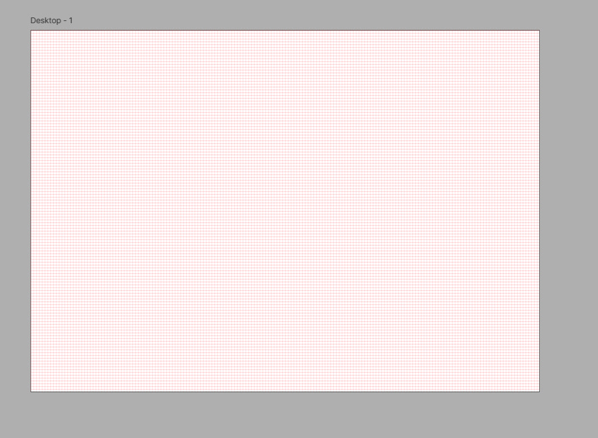
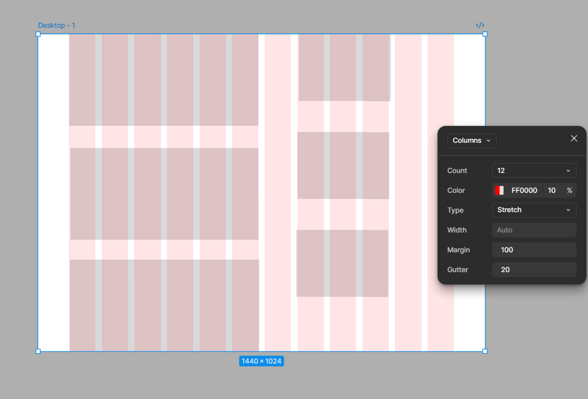
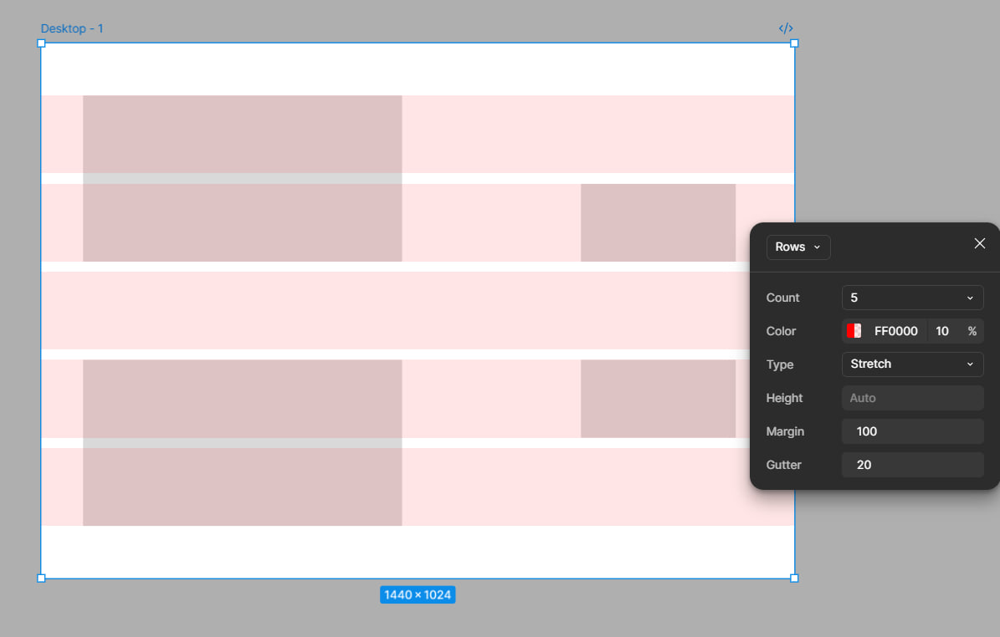

# ПЗ-11 Сітки у дизайні інтерфейсу.

## Тема заняття
Використання сіток у дизайні: створення та налаштування сітки у Figma і роль сіткової системи у веб-дизайні.

## Мета заняття
Ознайомитися з поняттям сітки (Grid) у Figma, навчитися створювати та налаштовувати сітки для макетів.
## Хід роботи

Після перегляду відео я зрозуміла, що сітка — це невидимі горизонтальні та вертикальні напрямні, які допомагають створювати рівні, впорядковані та пропорційні макети. У відео багато прикладів показано, як працюють сітки, і чому вони не просто допоміжний інструмент, а фактично основа гармонійного дизайну.

Сітки дозволяють дизайнерам:

- розміщувати елементи точно, а не “на око”;

- контролювати відступи, поля, вирівнювання і пропорції;

- створювати адаптивні макети, які добре виглядають на різних пристроях.

### Створення сітки у Figma

Сітка створюється у панелі властивостей:

- Виділяєш фрейм.

- У правій панелі додаєш Layout Grid.

- Обираєш тип сітки — Grid, Columns або Rows.

Для веб-дизайну найчастіше використовують колонкову сітку (Columns), наприклад на 12 колонок. Вісь кожної колонки служить як направляюча для розташування елементів, а відступи між колонками (gutter) — як простір між контентом.
Це дозволяє автоматично вирівнювати заголовки, блоки тексту, зображення й інші UI-елементи, щоб макет виглядав логічно та симетрично.

### Чому сітка важлива у веб-дизайні

Стаття, яку я прочитала, доповнила відео тим, що пояснила роль сіток у веб-сайтах, а не тільки у Figma. Сітка — це не просто допомога дизайнеру, це каркас макету, який:

- дозволяє створювати послідовні сторінки зі схожою структурою;

- робить дизайн акуратним і професійним;

- полегшує адаптацію під різні екрани, бо сітка задає логіку розміщення елементів навіть на маленьких пристроях.

### Практичне застосування

Зрозуміла, що сітка дуже важливий каркас в дизайні. Також звернуто увагу, що вона може мати різні налаштування відступів та ширини колонок, що робить її гнучкою для різних завдань: від широкого десктопного дизайну до вузьких мобільних екранів.

**Результат**

Grid

Columns

Rows

## Висновки
На цьому занятті я дізналася:

- що таке сітка та навіщо вона потрібна у дизайні;

- як її створювати та налаштовувати у Figma;

- чому саме сітки допомагають робити гармонійні, впорядковані та адаптивні макети;

- що використання сіток не тільки прискорює роботу дизайнера, а й робить процес передачі макета на розробку простішим і точнішим