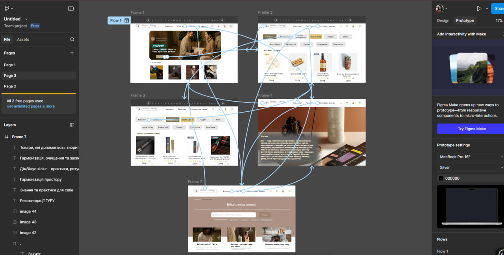
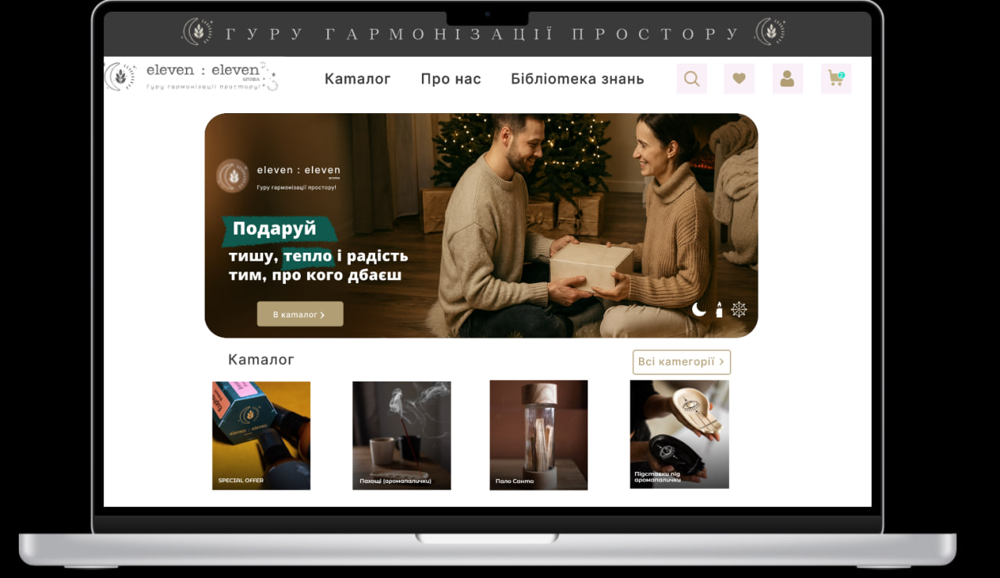
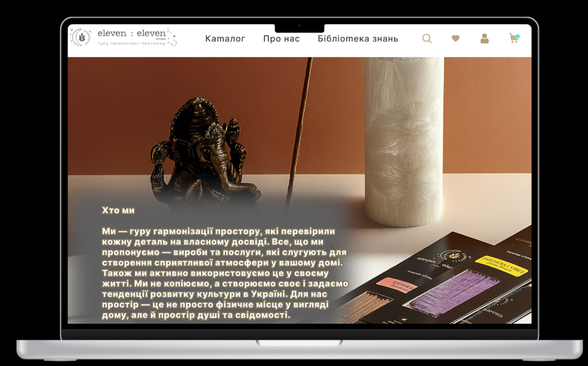
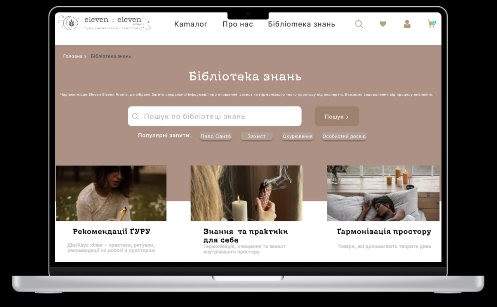

# ПЗ-12  Розробка wireframe.

## Тема заняття
Створення wireframe для інтернет-магазину.
## Хід роботи

### 1. Завдання 
1.Cтворити у Figma  деталізований  вайрфрейм  сайту для інтернет-магазину (головна сторінка та 2-3 сторінки товару). Тематику обрати самостійно. Розмір екранів - desktop.
2.Використати інструменти прототипування і зробити клікабельний прототип на основі вайфрейму.

**1.1 Опис роботи**

У Figma я підготувала кілька фреймів для прототипування сайту бренду eleven : eleven (гурy гармонізації простору). Усі фрейми виконані в єдиному стилі з однаковою шапкою та навігацією, щоб користувач не губився між сторінками. Також У режимі Prototype я налаштувала навігацію між фреймами.

**1.1. Результат**

**1.2 Створення структури головної сторінки (Frame 1)**

На головному фреймі я побудувала структуру сайту:

хедер з логотипом, меню (Каталог / Про нас / Бібліотека знань) та іконками (пошук, обране, профіль, кошик);

великий головний банер із закликом та кнопкою “В каталог”;

нижче — блок “Каталог” з прев’ю категорій (картки з фото та назвами).

**1.2. Результат**
 

**1.3. Створення сторінки “Каталог” (Frame 2)**

На фреймі каталогу я реалізувала сторінку зі списком товарів та навігацією по категоріях:

зверху зробила категорії/таби (Каталог, Bestseller, Пахощі, Пало Санто, Ладан, New тощо);

нижче — товарні картки, в яких є:

фото продукту, назва, відгуки (зірочки), ціна.

Копія справжнього інтернет-магазину: одразу видно товар і ключову інформацію.

**1.3. Результат**

**1.4. Створення сторінки категорії (Frame 3 — “Пахощі (аромапалочки)”)**

Окремо зробила фрейм під конкретну категорію “Пахощі (аромапалочки)”:

активна категорія виділена (видно, де користувач знаходиться);

для товарів залишила карткову структуру, додала: фото, назву, відгуки, ціну, іконки (в обране/кошик).

**1.4. Результат**

**1.5. Створення сторінки “Хто ми / Про нас” (Frame 4)**

На сторінці “Про нас” я використала велике атмосферне фото і наклала текстовий блок з прозорим затемненням (щоб текст читався).
Тут розміщена інформація про:

- хто така команда,

- що пропонують,

- ідея гармонізації простору.

**1.5. Результат**

**1.6. Створення сторінки “Бібліотека знань” (Frame 5)**

На цьому фреймі реалізовано інформаційний розділ:

- заголовок “Бібліотека знань”;

- пошук по матеріалах;

- “популярні запити” у вигляді кнопок/тегів (Пало Санто, Захист, Окурювання…);

- блоки з картками статей/розділів (рекомендації, практики, гармонізація простору).

**1.6. Результат**

## Висновки
Під час виконання практичного завдання я:
- створила проєкт і кілька фреймів у Figma (головна, каталог, категорії, “Про нас”, “Бібліотека знань”);
- побудувала структуру сторінок: хедер, банер, блоки категорій та товарні картки;
- налаштувала переходи між сторінками у режимі Prototype через меню та кнопки.

Ця робота навчила мене:
- правильно організовувати макет сайту через фрейми та секції;
- створювати зручну навігацію та логіку переходів між екранами;
- створювати зручну навігацію та логіку переходів між екранами.