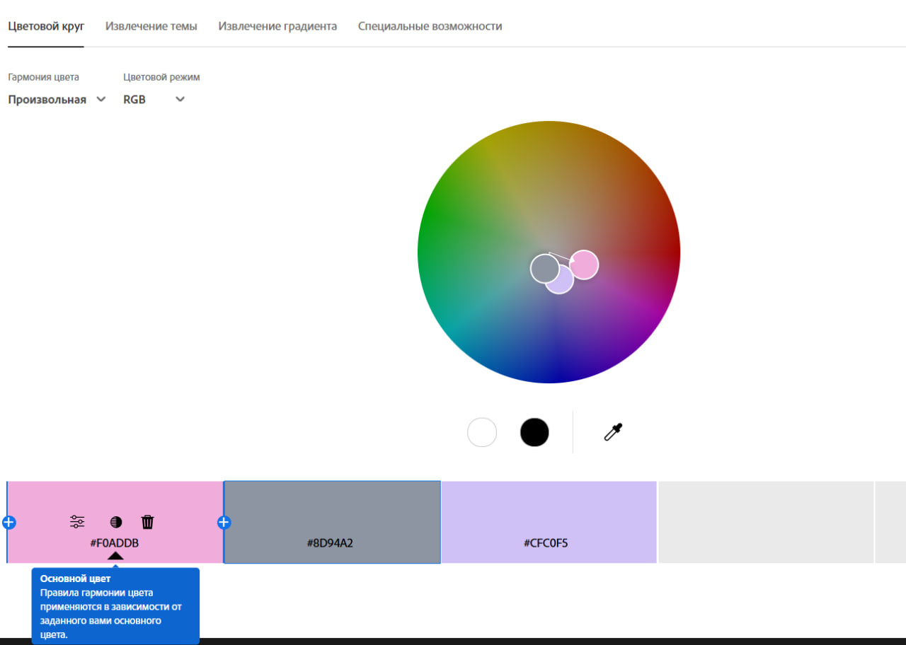
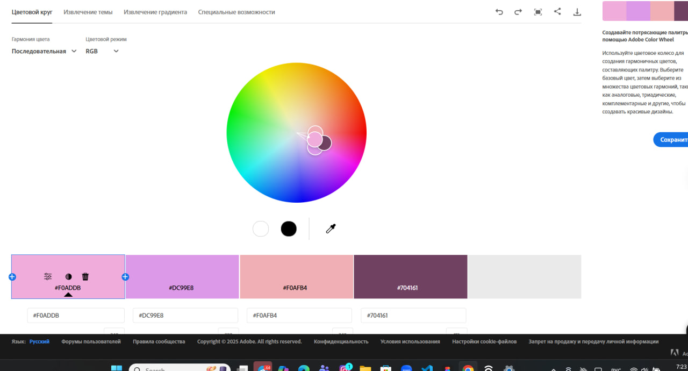
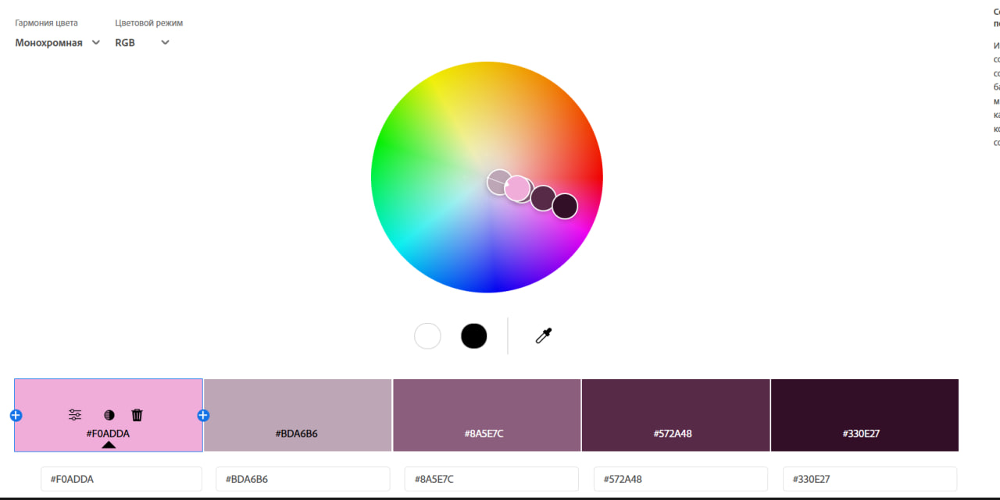
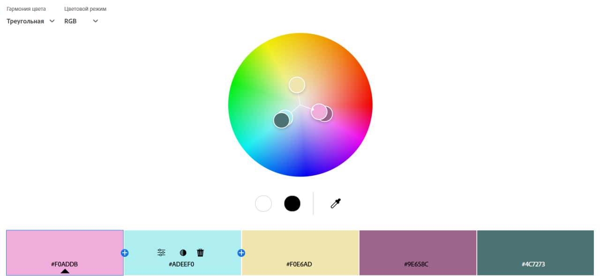
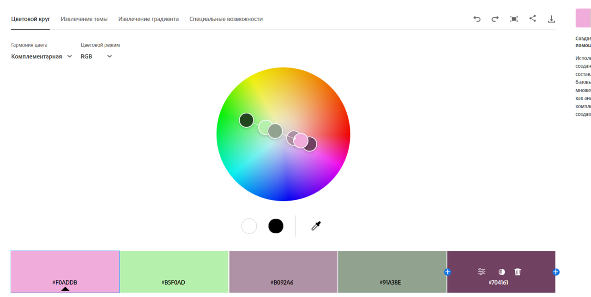
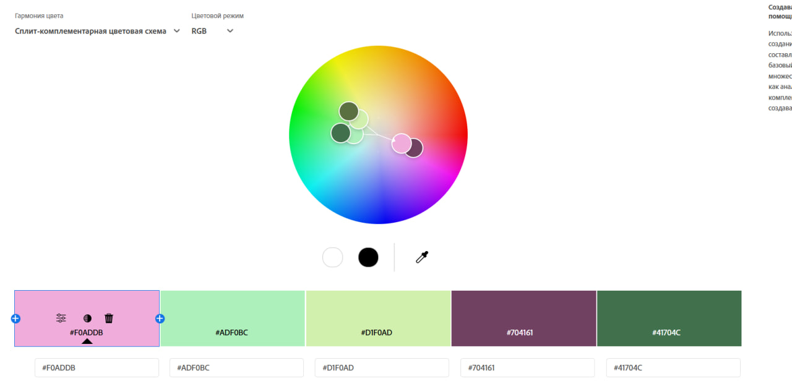
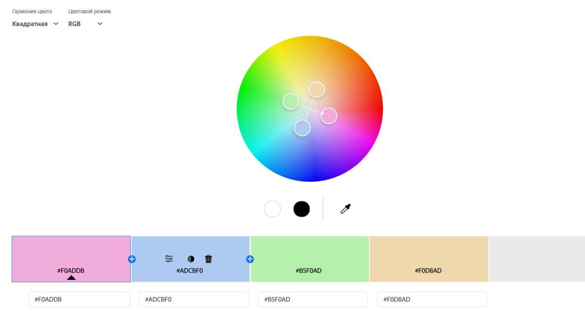
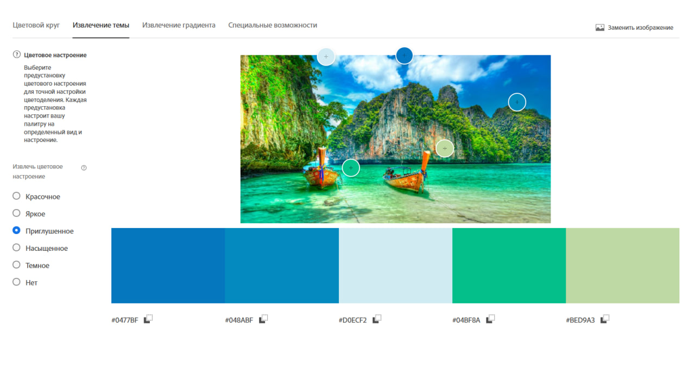
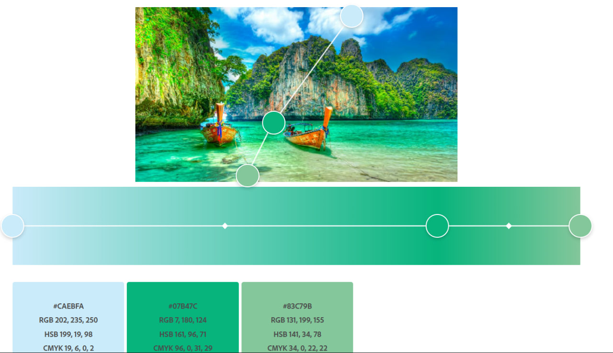
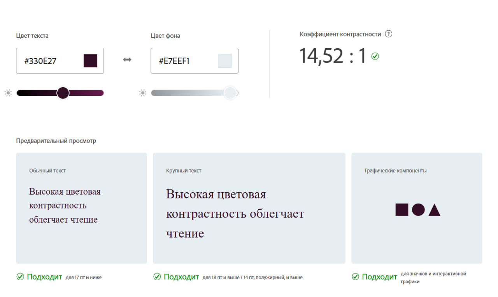

# ПЗ-13 Дослідження кольорових гармоній та інструментів аналізу кольору в Adobe Color.

## Мета заняття
- Ознайомити студентів із поняттям кольорової гармонії та основними типами гармонії кольорів
- Навчити студентів використовувати колірне колесо для побудови палітр за різними
принципами гармонії.
- Ознайомити із можливостями автоматичного виділення кольорових палітр із
зображень та створення градієнтів.
- Навчити перевіряти контрастність кольорових пар відповідно до стандартів
доступності (WCAG).
- Закріпити навички документування та аналізу роботи з кольором у
Markdown-форматі у GitHub-репозиторії.

## Хід роботи

### Теоретична частина

Кольорова гармонія — це принцип узгодженого поєднання кольорів, який використовується в дизайні для створення цілісного, естетично привабливого та функціонального візуального середовища. Вона забезпечує правильне сприйняття інформації користувачем, допомагає сформувати візуальну ієрархію та акцентувати увагу на важливих елементах інтерфейсу.

Типи гармонії:

- Analogous 
Аналогічна гармонія базується на використанні кольорів, які розташовані поруч на колірному колі. Вона створює спокійне та природне враження, проте потребує додаткового контрасту для текстових елементів.

- Monochromatic 
Монохроматична гармонія використовує один базовий колір із різними відтінками, яскравістю та насиченістю. Така схема виглядає цілісно та акуратно, але може здаватися одноманітною без акцентів.

- Triad 
Тріадна гармонія складається з трьох кольорів, рівновіддалених на колірному колі. Вона забезпечує баланс між контрастом і гармонійністю, але потребує обережного використання, щоб уникнути надмірної яскравості.

- Complementary 
Комплементарна гармонія базується на використанні кольорів, які знаходяться навпроти один одного на колірному колі. Вона створює сильний контраст і часто використовується для акцентів, але може бути візуально агресивною.

- Split Complementary 
Розділена комплементарна гармонія включає основний колір і два сусідні до його комплементарного. Така схема забезпечує контраст, але виглядає м’якше, ніж класична комплементарна.

- Square
Квадратна гармонія складається з чотирьох кольорів, рівномірно розташованих на колірному колі. Вона є насиченою та складною в балансуванні, тому зазвичай використовується в креативному дизайні.

- Custom
Власна кольорова схема створюється без суворих правил і базується на цілях проєкту, бренді та емоційному посилі.

Колірні моделі 
RGB (використовується для екранів і цифрових пристроїв, утворюється шляхом змішування червоного, зеленого та синього світла), HSB (модель, що описує колір через тон, насиченість і яскравість, більш інтуїтивна), LAB (складається з параметрів світлості (L) та двох колірних осей (A і B), забезпечує високу точність передачі кольорів і використовується в професійній обробці зображень).

Контрастне співвідношення — це показник різниці яскравості між текстом і фоном. Воно визначає, наскільки добре елементи інтерфейсу читаються користувачами.

Рівень AA: звичайний текст (>=4.5:1), великий (>=3:1)

Рівень AAA: звичайний текст (>=7:1), великий (>=4.5:1)

### 1. Завдання 
1. Робота з колірним колесом (Color Wheel)

- 1 Базовий колір

Базовий колір: (#F0ADDB) 
RGB: 240, 173, 219

HSB: 319, 28, 94

**Результат**

2. Створіть палітри для кожного типу гармонії:

- 1 Analogous

HEX: #F0ADDB, #DC99E8, #F0AFB4, #704161 

Логіка побудови: Кольори розташовані поруч із базовим на колірному колі та мають близький тон.

Передбачуваний емоційний ефект: М’який, спокійний, гармонійний. Підходить для фону та декоративних елементів.

**Результат**

- 2 Monochromatic

HEX: #F0ADDB, #BDA6B6, #8A5E7C, #572A48, #330E27

Логіка побудови: Монохромна палітра побудована на основі одного базового кольору із використанням його світліших і темніших відтінків. Тон залишається незмінним, змінюється лише яскравість і насиченість, що забезпечує візуальну цілісність палітри.

Передбачуваний емоційний ефект: Створює відчуття спокою, стабільності й елегантності

**Результат**

- 3 Triad

HEX: #F0ADDB, #ADEEF0, #F0E6AD, #9E658C, #4C7273

Логіка побудови: Поєднуються рожево-фіолетовий, світло-блакитний та світло-жовтий відтінки, а також їхні темніші варіації для балансу. Такий підхід дозволяє зберегти гармонію, водночас додаючи різноманіття кольорів.

Передбачуваний емоційний ефект: Створює відчуття динамічності, легкості та позитивного настрою. Таке поєднання кольорів добре підходить для акцентних елементів і дизайнів.

**Результат**

- 4 Complementary

HEX: #F0ADDB, #B5F0AD, #B092A6, #91A38E, #704161, #22461D

Логіка побудови: Комплементарна палітра побудована на поєднанні базового кольору з кольорами, розташованими навпроти нього на колірному колі.

Передбачуваний емоційний ефект: Таке поєднання створює відчуття свіжості, балансу та візуальної динаміки.

**Результат**

- 5 Split Complementary

HEX: #F0ADDB, #ADF0BC, #D1F0AD, #704161, #41704C, #5B7041

Логіка побудови: Світлі відтінки зеленого створюють баланс і врівноважують рожево-фіолетову основу, а темніші кольори додають глибини та завершеності палітрі.

Передбачуваний емоційний ефект: створює відчуття рівноваги та візуальної стабільності, добре підходить для інтерфейсів, де важливо поєднати виразність і зручність.

**Результат**

- 6 Square

HEX: #F0ADDB, #ADCBF0, #B5F0AD, #F0D8AD

Логіка побудови: Побудовано на основі базового кольору та трьох додаткових кольорів, які рівномірно розташовані на колірному колі з інтервалом у 90 градусів.

Передбачуваний емоційний ефект: створює відчуття креативності, ніжності та живості. Таке поєднання кольорів добре підходить для сучасних дизайнів, де важливо передати ніжність та енергію.

**Результат**

- 7 Custom

HEX: #F0CDEE, #E7EEF1, #D5A7F5, #EEDBC0, #546794 

Логіка побудови: За основу взято м’які пастельні відтінки рожевого, блакитного та фіолетового, які гармонійно  та ніжно поєднуються між собою.

Передбачуваний емоційний ефект: Палітра сприймається ніжно та сучасно, створює відчуття легкості, спокою й естетичності. Водночас темніші акценти додають серйозності та завершеності, що робить її універсальною.

**Результат**

### 2. Завдання 
2. Створення палітри зображенням (Extract Theme)

**Зображення**

- Colorful

HEX: #0477BF, #048ABF, #04BF7B, #034001, #F25C05 

- Muted

HEX: #0477BF, #048ABF, #D0ECF2, #04BF8A, #BED9A3

Для інтерфейсу додатку більше підходить палітра з настроєм Muted, бо має менш насичені, спокійні кольори, які не перевантажують зір користувача. Такі відтінки краще підходять для тривалого використання інтерфейсу, оскільки забезпечують комфортне сприйняття інформації, добре поєднуються з текстом і елементами керування та не відволікають увагу від основного контенту.

### 3. Завдання 
3. Створення градієнту на основі зображення (Extract Gradient)

- Gradient Stops = (3)

HEX: #CAEBFA, #07B47C, #83C79B 

Емоційно градієнт створює відчуття спокою, свіжості та легкості. Він асоціюється з відпочинком, свободою та природною рівновагою. Такий настрій добре підходить для інтерфейсів додатків, пов’язаних із подорожами, wellness, природою або релаксацією, оскільки не перевантажує зір і сприяє комфортному сприйняттю інформації.

### 4. Завдання 
4. Аналіз контрасту (Accessibility Tools)

Пара кольорів:

- колір тексту — #330E27

- колір фону — #E7EEF1

Коефіцієнт контрастності становить 14,52 : 1

рівень AA : проходить, звичайний (вимога ≥ 4.5 : 1), великий (вимога ≥ 3 : 1)

рівень AAА : проходить, звичайний (вимога ≥ 7 : 1), великий (вимога ≥ 4.5 : 1)

## Висновки
У ході роботи було встановлено, що для інтерфейсів додатків найкраще підходять монохромні, аналогічні та приглушені (Muted) палітри, оскільки вони створюють візуальну цілісність і не перевантажують зір користувача. Такі підходи забезпечують комфортне сприйняття інформації та хорошу читабельність тексту.

Комплементарні та тріадні гармонії доцільно використовувати переважно для акцентів, оскільки вони створюють сильні контрасти. Використання перевірки контрастності за стандартами WCAG є необхідним для забезпечення доступності інтерфейсу.