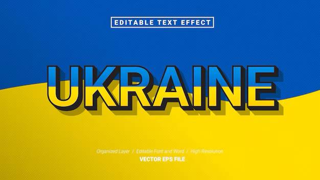
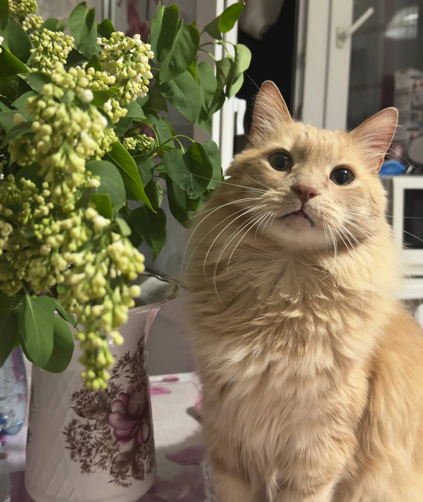
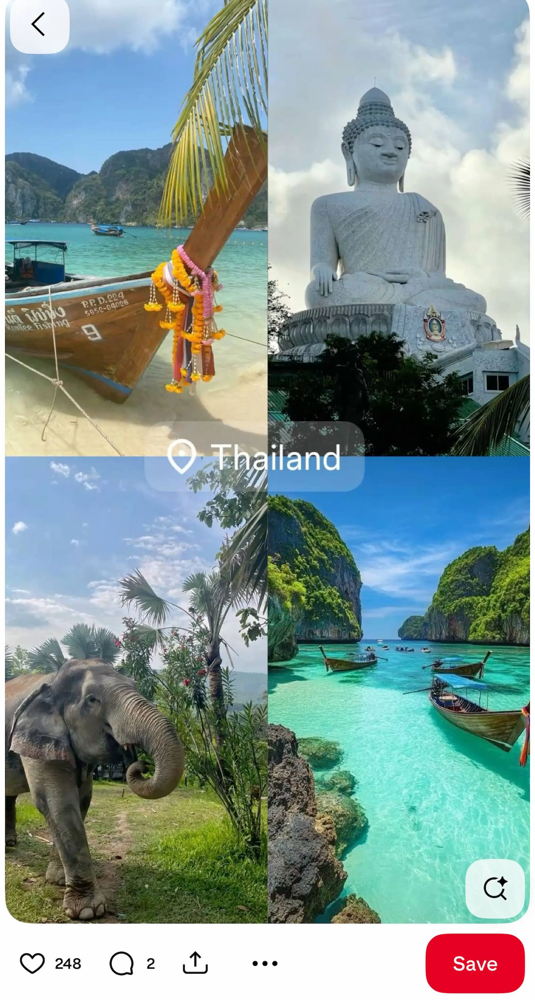
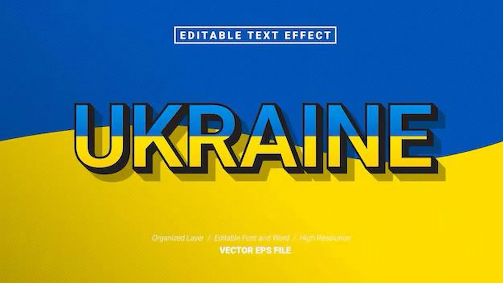

# ПЗ-14 Оптимізація зображень за допомогою Squoosh.

## Мета заняття
- Ознайомити студентів із методами стиснення зображень та їхнім впливом на якість.
- Навчити визначати оптимальний баланс між якістю та розміром файлу.
- Ознайомити студентів із різними типами стиснення: без втрат (lossless) та з втратами (lossy).
- Дослідити вплив зміни розміру на якість зображення та вагу файлу.
- Навчитися адаптувати зображення для різних цільових застосувань:
  - Веб (оптимізація для швидкого завантаження).
  - Мобільні пристрої (зменшені розміри, ефективне стиснення).
  - Retina-дисплеї (2x, 3x версії для збереження якості).
- Закріпити навички документування та аналізу результатів у Markdown-форматі у GitHub-репозиторії.

## Хід роботи

### Теоретична частина

Squoosh — це вебінструмент від Google для стиснення та оптимізації зображень. Він дозволяє порівнювати оригінал і стиснуту версію в реальному часі, змінювати формат, рівень стиснення та розмір зображення без встановлення додаткового програмного забезпечення.

Формати зображень та типи стиснення

Стиснення без втрати якості (lossless) зберігає всі деталі зображення, але зменшує розмір файлу за рахунок ефективнішого кодування. До таких форматів належать PNG та WebP (lossless). Вони підходять для графіки, іконок та інтерфейсних елементів.

Стиснення з втратою якості (lossy) зменшує вагу файлу за рахунок часткової втрати деталей, що зазвичай малопомітно для користувача. До цієї групи належать MozJPEG, WebP (lossy) та AVIF. Ці формати часто використовуються для фотографій та фонів.

Зміна розміру та її вплив на якість і вагу файлу

Зменшення розміру зображення напряму впливає на зменшення ваги файлу. Чим менша роздільна здатність, тим менший розмір файлу і швидше завантаження сторінки. Проте надмірне зменшення може призвести до втрати чіткості та якості.

Оптимізація зображень для Retina-дисплеїв

Для Retina-дисплеїв використовують зображення збільшеного розміру (2x або 3x), щоб зберегти чіткість на екранах з високою щільністю пікселів.

У вебі для цього застосовують адаптивні зображення через srcset, що дозволяє браузеру автоматично обирати оптимальну версію зображення залежно від роздільної здатності екрана.

### 1. Завдання 
1. Аналіз вихідних файлів

- Виберіть 3 типи зображень (фотографія, скріншот, графічне зображення з текстом).

- Зафіксуйте їхній початковий розмір, формат (JPEG, PNG тощо) та вагу файлу.

Фотографія

- Формат: JPEG

- Розмір: 423 KB

- Тип: фотографія

- Опис: На фотографії зображено персикового кота, який сидить поруч з квітами. Кіт дивиться прямо в камеру, що створює відчуття живої взаємодії з глядачем. Освітлення природне, м’яке, підкреслює текстуру шерсті та деталі об’єкта. Фотографія передає теплу, затишну атмосферу домашнього середовища.

Для таких зображень доцільно використовувати формати зі стисненням з втратою якості (lossy), наприклад JPEG (MozJPEG) або WebP (lossy), оскільки вони дозволяють значно зменшити розмір файлу без помітної втрати візуальної якості.
Формат PNG у цьому випадку буде менш ефективним через більшу вагу файлу.

Скріншот

- Формат: PNG

- Розмір: 376 KB

- Тип: скріншот

- Опис: На скріншоті зображено добірку фотографій, об’єднаних тематикою подорожей до Таїланду. У кадрах представлені природні пейзажі, море, човни, статуя Будди та дика природа. Скріншот демонструє інтерфейс мобільного додатку з елементами навігації та взаємодії користувача.

Для таких зображень важливо зберегти різкість і читабельність тексту, тому оптимальним є використання стиснення без втрати якості (lossless) — форматів PNG або WebP (lossless).
Стиснення з втратою якості може призвести до появи артефактів і погіршення чіткості тексту, що негативно вплине на сприйняття інтерфейсу.

Графічне зображення з текстом

- Формат: PNG

- Розмір: 19 KB

- Тип: графічне зображення з текстом

- Опис: Колірна гама побудована на поєднанні синього та жовтого кольорів, що асоціюються з національним прапором України. Текст має декоративний ефект тіні та об’єму, що робить його виразним і помітним.

Дане зображення є графічним дизайном з великими кольоровими площинами, градієнтом та текстом. Для збереження чіткості шрифтів і плавності градієнтів доцільно використовувати PNG або WebP (lossless).
У разі використання у вебі також ефективним рішенням є векторний формат (SVG), оскільки він дозволяє масштабувати зображення без втрати якості та має мінімальну вагу файлу.

### 2. Завдання 
2. Стиснення без втрати якості (lossless)

1. Фото

Формат стиснення: WebP (lossless)

Оригінал: 423 KB (JPEG)

Після стиснення: 231 KB (WebP, lossless)

Зменшення розміру: приблизно 45%

- Висновок: Після застосування lossless-стиснення у форматі WebP візуальна якість фотографії повністю збереглася. Деталі зображення, текстура шерсті кота, кольори квітів і фон залишилися чіткими та без помітних артефактів. Візуально зображення не відрізняється від оригіналу.

**Результат**

Після стиснення:

.webp)

2. Скріншот

Формат стиснення: WebP (lossless)

Оригінал: 376 KB (PNG)

Після стиснення: 262 KB (WebP, lossless)

Зменшення розміру: приблизно 30%

- Висновок: Lossless-стиснення добре підходить для скріншотів інтерфейсів, оскільки дозволяє зменшити розмір файлу без будь-яких втрат якості. Однак ступінь стиснення є обмеженим, тому навіть після оптимізації файл залишається відносно великим у порівнянні з lossy-форматами.

**Результат**

Після стиснення:

3. Графічне зображення з текстом

Формат стиснення: WebP (lossless)

Оригінал: 19.4 KB (PNG)

Після стиснення: 11.6 KB

Зменшення розміру: приблизно 40%

- Висновок: Після стиснення графічне зображення з текстом повністю зберегло чіткість шрифтів, контури та плавність градієнтів.

**Результат**

Після стиснення:

### 3. Завдання 
 3. Стиснення з втратою якості (lossy)

 1. Фото

 | Формат  | 100%   | 75%    | 50%    |
 |---------|--------|--------|--------|
 | MozJPEG | 1.25 MB| 364 KB | 230 KB |
 | WebP    | 931 KB | 231 KB | 169 KB |
 | AVIF    | 668 MB | 289 KB | 124 KB |

**Аналіз та висновок**

Найбільше зменшення розміру файлу забезпечує формат AVIF, який навіть при 50% якості дає найменший розмір файлу при прийнятній візуальній якості. Формат WebP показує збалансований результат між якістю та розміром, тоді як MozJPEG має найбільший розмір файлу на всіх рівнях якості.

**Мінімальний прийнятний рівень якості**

Для досягнення оптимального співвідношення якості та розміру файлу доцільно використовувати формати WebP (lossy) або AVIF з рівнем якості 75%.

**Результат**

WebP(75%)

2. Скріншот

 | Формат  | 100%   | 75%    | 50%    |
 |---------|--------|--------|--------|
 | MozJPEG | 1.13 MB| 353 KB | 213 KB |
 | WebP    | 195 KB | 262 KB | 169 KB |
 | AVIF    | 661 MB | 321 KB | 180 KB |

**Аналіз та висновок**

Рівень 100% зберігає максимальну якість, проте розмір файлу є надто великим для ефективного веб-використання.
Рівень 50% забезпечує значне зменшення розміру, однак помітно погіршує якість зображення (втрата деталей, артефакти).
Оптимальним варіантом виявився рівень 75%, оскільки він забезпечує хороший баланс між якістю та розміром файлу. Візуально зображення залишається чітким і придатним для використання, а розмір файлу суттєво зменшується.

**Мінімальний прийнятний рівень якості**

Серед використаних форматів найкращий результат при якості 75% показує формат WebP, оскільки він забезпечує найменший розмір файлу за збереження хорошої якості. Формат AVIF також демонструє ефективне стиснення, але у деяких випадках має більший розмір або повільніше підтримується браузерами. MozJPEG дає більший розмір файлу порівняно з WebP.

**Результат**

WebP(75%)

3. Графічне зображення з текстом

 | Формат  | 100%   | 75%    | 50%    |
 |---------|--------|--------|--------|
 | MozJPEG | 94 KB  | 17,9 KB| 11,4 KB|
 | WebP    | 51,9 KB| 11,6 KB| 8,84 KB|
 | AVIF    | 41,7 KB| 16,5 KB| 7,29 KB|

**Аналіз та висновок**

Формат AVIF забезпечує найменший розмір файлу при прийнятній якості, особливо на рівні 50–75%. WebP демонструє хороший баланс між якістю та вагою файлу, тоді як MozJPEG має більший розмір у порівнянні з сучасними форматами.

**Мінімальний прийнятний рівень якості**

Для графічних зображень із текстом оптимальним мінімальним рівнем якості є 75%, а найкращими форматами для веб-використання є WebP та AVIF, оскільки вони забезпечують високу читабельність і мінімальний розмір файлу.

**Результат**

AVIF(75%)

### 4. Завдання 
4. Оптимізація розміру відповідно до цільового використання

1. Фото

 | Версія  | Формат | Розмір |  Вага  |
 |---------|--------|--------|--------|
 | Веб     | Webp   | 1200px | 111  KB|
 | Мобільні| Webp   | 600px  | 46.7 KB|
 | Retina  | Webp   | 2400px | 255 KB |

- Веб

- Моб

- Retina

 2. Скріншот

 | Версія  | Формат | Розмір |  Вага  |
 |---------|--------|--------|--------|
 | Веб     | Webp   | 1200px | 241  KB|
 | Мобільні| Webp   | 600px  | 92.5 KB|
 | Retina  | Webp   | 2400px | 536 KB |

- Веб

- Моб

- Retina

3. Графічне зображення з текстом

 | Версія  | Формат | Розмір |  Вага  |
 |---------|--------|--------|--------|
 | Веб     | Webp   | 1200px | 26.3 KB|
 | Мобільні| Webp   | 600px  | 11.2 KB|
 | Retina  | Webp   | 2400px | 69.5 KB|

- Веб

- Моб

- Retina

### 5. Завдання 
5. Візуальний аналіз та висновки

Під час порівняння вихідних і оптимізованих зображень було помітно, що за правильно підібраних форматів і параметрів стиснення можна суттєво зменшити розмір файлу без помітної втрати якості. Для фотографій формати WebP та AVIF показали найкраще співвідношення між якістю та вагою файлу, особливо на рівні якості 75%, де зображення залишаються візуально прийнятними для вебу.
Формат MozJPEG також ефективний для фотографій, проте за однакової якості його файли зазвичай мають більший розмір у порівнянні з WebP та AVIF. 

## Висновки
У ході роботи було встановлено, що для фотографій найкраще підходять формати WebP та AVIF, оскільки вони забезпечують суттєве зменшення розміру файлу при збереженні прийнятної якості, оптимальним рівнем якої є 75%. 

Для графічних зображень з текстом найефективнішими виявилися WebP та AVIF, оскільки вони краще зберігають чіткість контурів і тексту при мінімальному розмірі файлу.

Зменшення розміру зображення напряму впливає на оптимізацію — чим менша роздільна здатність, тим менша вага файлу, однак важливо не втратити деталізацію. Для Retina-дисплеїв доцільно використовувати зображення у масштабі 2x або 3x разом з адаптивними технологіями (srcset), що дозволяє поєднати високу чіткість і оптимальне завантаження.