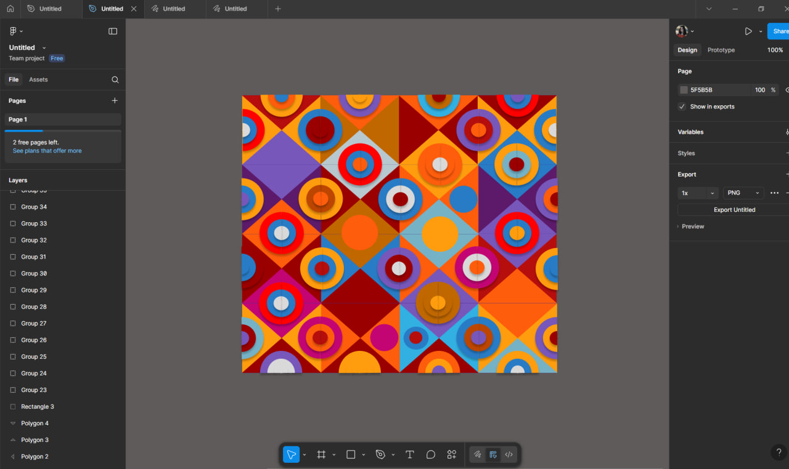

# ПЗ-3 Робота з простими формами та їх властивостями у Figma. Створення геометричного візерунку.

## Тема заняття
ВИКОРИСТАННЯ ПРОСТИХ ФІГУР ТА ВЛАСТИВОСТЕЙ СЕРВІСУ Figma СТВОРИТИ ФРАГМЕНТ ГЕОМЕТРИЧНОГО ВІЗЕРУНКУ
## Хід роботи

### 1. Початок роботи
Метою моєї роботи було розробити яскравий геометричний візерунок, використовуючи лише прості фігури — кола, трикутники та квадрати. Саме ці базові елементи стали основою майбутньої композиції.

### 2. Побудова структури візерунку
Я розташувала квадрати у вигляді рівномірної сітки, щоб утворити чіткий ритм. Далі використала 4 трикутника на кожний квадрат. У центр кожного квадрата додала кілька концентричних кіл різних кольорів і діаметрів. Завдяки цьому виникла цікава гра форм, що нагадує мозаїку або орнамент.

### 3. Підбір кольорів та контрастів
Велике значення мала колірна гама. Я обрала насичені відтінки червоного, помаранчевого, синього, фіолетового й жовтого. Поєднання теплих і холодних кольорів створило контраст і глибину, а повторення відтінків у різних частинах візерунку допомогло зберегти гармонію та ритм.

### 4. Завершення композиції
Коли всі елементи були розміщені, я перевірила пропорції, симетрію та відстані між формами. У результаті вийшов яскравий, ритмічний і збалансований геометричний візерунок.

## Висновки
Під час виконання практичного завдання я:
- навчилася використовувати прості геометричні фігури як основні будівельні елементи дизайну;
- відпрацювала техніку поєднання форм і створення ритмічних візерунків;
- засвоїла принципи кольорової гармонії та контрасту.

Ця робота навчила мене:
- cтворювати складні композиції з простих фігур;
- pозуміти, як ритм, симетрія й повторення впливають на сприйняття дизайну.
