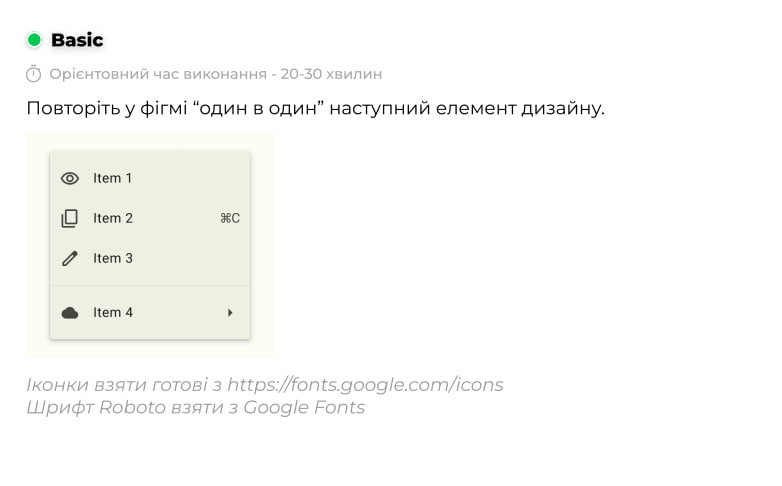
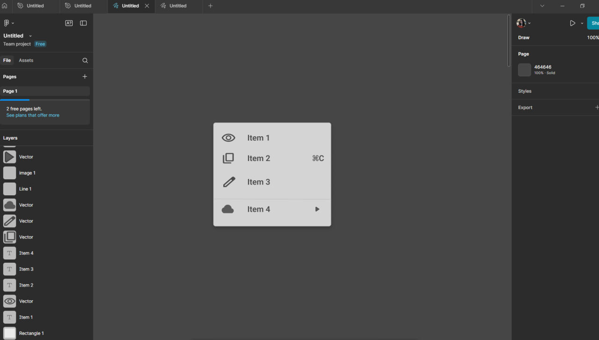
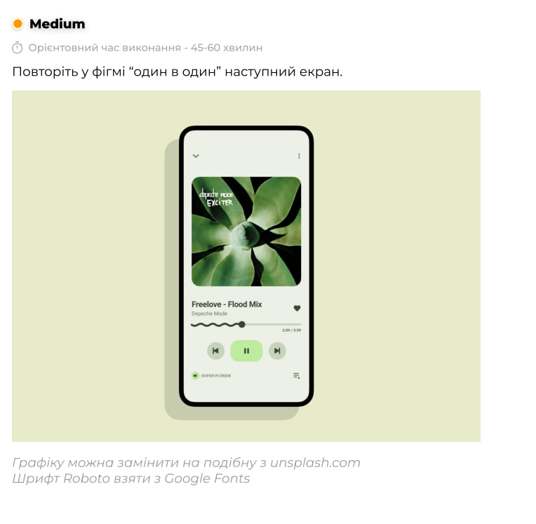
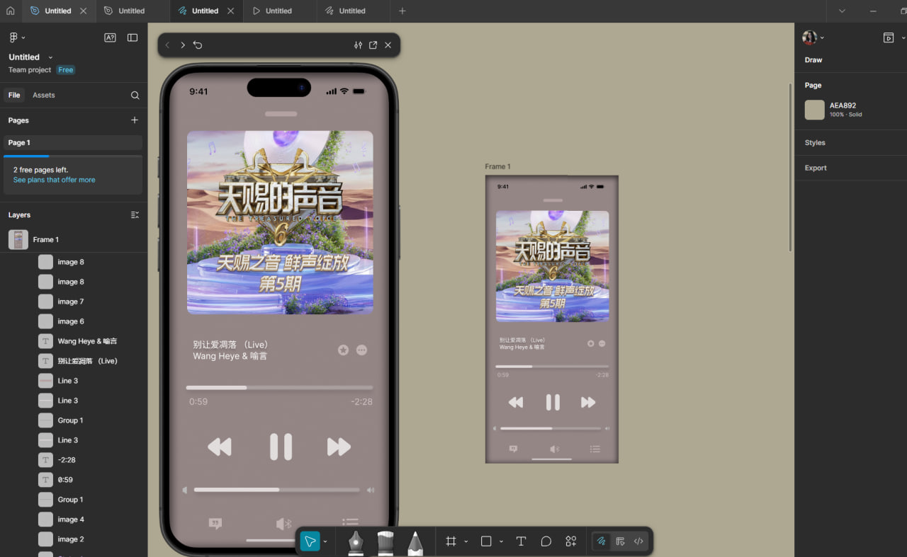
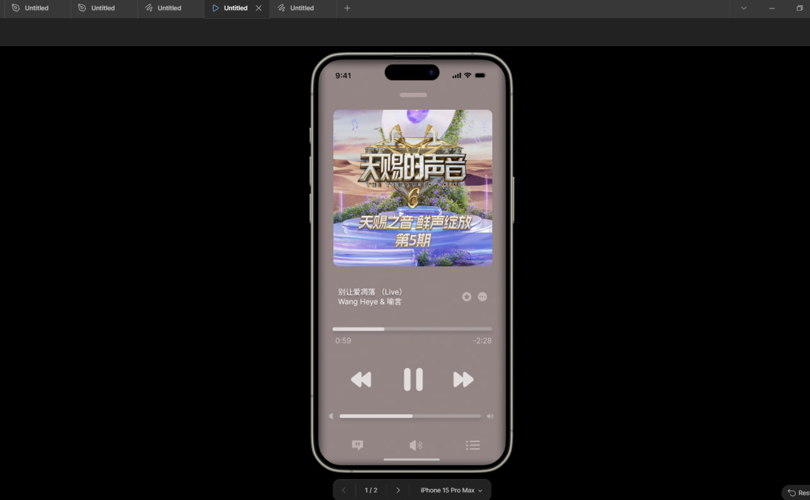
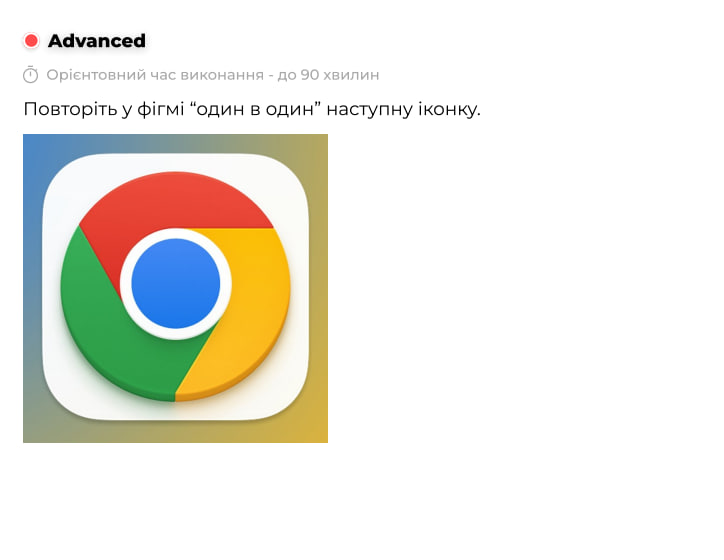
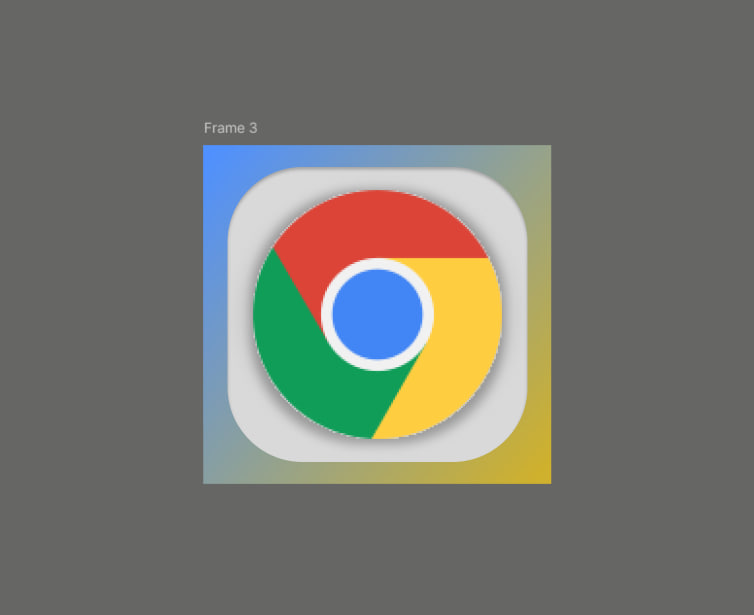
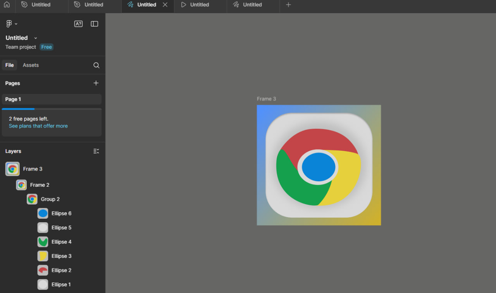

# ПЗ-4 Фрейми, групи і секції у Figma

## Тема заняття
Спробувати повторити елементи дизайну за рінем складності
## Хід роботи

### 1. Завдання рівня Basic

**1.1. Приклад**

**1.2. Опис роботи**

Роботу я розпочала зі створення фрейму, який став основним робочим простором для майбутнього елемента інтерфейсу. Для цього обрала інструмент Frame (F) та задала необхідні розміри відповідно до прикладу. Усередині фрейму я розмістила чотири рядки — кожен із них містив іконку, текстову назву та додатковий символ. 

**1.3. Результат**

### 2. Завдання рівня Medium

**2.1. Приклад**

**2.2. Опис роботи**

Спочатку я створила фрейм, який відтворює екран смартфона Iphone 15pro Max. У верхній частині екрана я розмістила квадратне зображення альбомної обкладинки. Під зображенням додала два текстові блоки: назву композиції та ім’я виконавця. Далі я створила кнопки керування — «попередня», «пауза/відтворення» та «наступна». Спробувала зробити екран максимально схожим на додаток Apple Music

**2.3. Результат**

**2.4. Результат**

### 3. Завдання рівня Advanced

**3.1. Приклад**

**3.2. Опис роботи**

Перший варіант роботи я зробила за допомогою скачаного логотипа Chrome, все інше робила за допомогою фрейму, градієнтої заливки, прямокутники з ефектом закруглення та об'єму. У другому варіанті логотип виготовлявся за допомогою кіл. Спробувала зробити максимально схожим на приклад іконки.

**3.3. Результат 1**

**3.4. Результат 2**

## Висновки
Під час виконання практичного завдання я:
- навчилася групувати об’єкти для зручності редагування;
- закріпила навички роботи з іконками та шрифтами Google Fonts;
- відтворила дизайн екрана музичного плеєра як в Iphone15proMax;
- працювати з колами для досягнення потрібних форм.

Ця робота навчила мене:
- працювати з іконками та шрифтами, підбираючи стильні та гармонійні поєднання.;
- виконувати точне відтворення інтерфейсного елемента за прикладом;
- підбирати гармонійні кольори та працювати з відтінками.