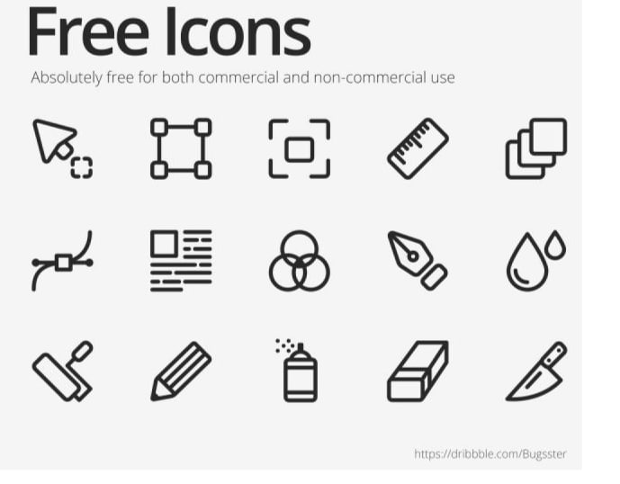
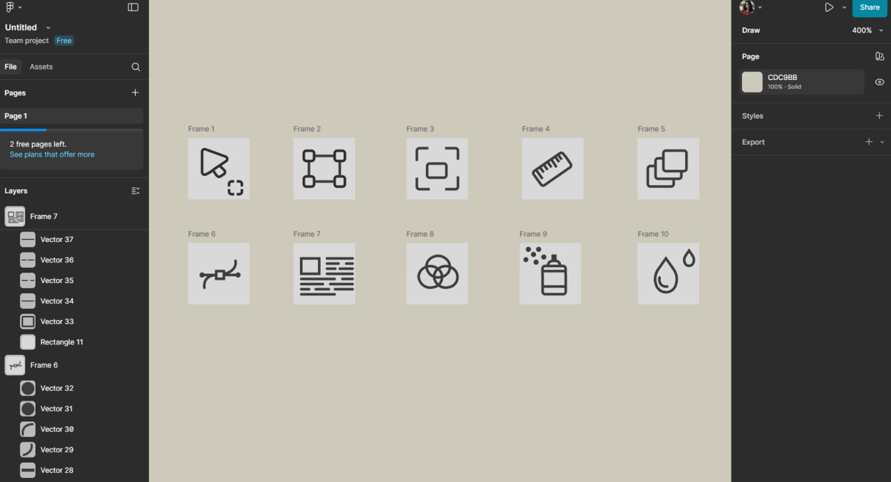

# ПЗ-5 Криві Безьє, векторні об'єкти  у Figma. Створення векторних значків (іконок).

## Тема заняття
Опанування інструмента Pen Tool для створення кривих Безьє у Figma
## Хід роботи

### 1. Завдання 
Створити  п'ять іконок  за вибором:

**1.1. Приклад**

**1.2. Опис роботи**

На початку роботи я вивчила можливості інструмента Pen Tool, який дозволяє створювати векторні лінії та фігури за допомогою кривих Безьє. Цей інструмент використовується для побудови точних контурів і плавних ліній, що є основою для створення іконок та графічних елементів. Для практики я створила 10 векторних значків

**1.3. Результат**

## Висновки
Під час виконання практичного завдання я:
- опанувала принцип побудови кривих Безьє у Figma;;
- використала інструменти Pen Tool;
- створила набір іконок у єдиному стилі.

Ця робота навчила мене:
- використовувати Pen Tool для побудови кривих і контурів будь-якої складності;
- розуміти принцип роботи кривих Безьє та їхнє застосування у векторному дизайні;
- створювати мінімалістичні та чіткі іконки, які можна застосовувати в інтерфейсах, логотипах чи вебдизайні.