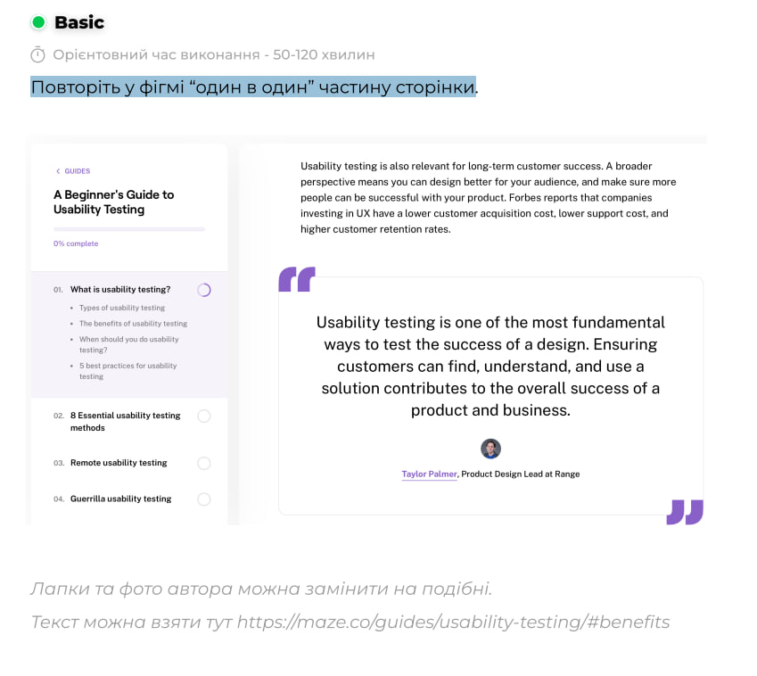
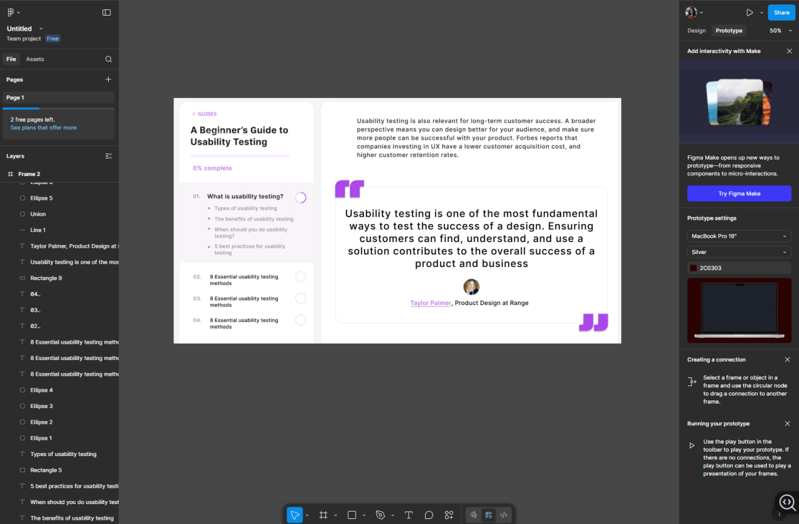

# ПЗ-7-8 Типографіка в дизайні інтерфейсів

## Тема заняття
Типографіка в дизайні користувальницького інтерфейсу.
## Хід роботи

### 1. Завдання 
Повторити у фігмі "один в один" частину сторінки.

**1.1. Приклад**

**1.2. Опис роботи**

У цій практичній роботі моє завдання було не лише повторити розташування блоків, а й передати всю структуру тексту, його логіку, візуальну ієрархію та характер оформлення. 

Я почала з побудови основної композиції — лівої панелі навігації та великого контентного блоку праворуч. Уважно підібрала кольори фону, ширину фреймів і відступи, щоб макет виглядав охайно. Також я відтворила всі шрифтові акценти: заголовок, маленький напис “0% complete”, номери секцій та пункти списку з правильним відступом і маркерами. Особливу увагу я приділила шрифтам —  обрала правильні ваги і налаштувала міжрядкові інтервали. Це дозволило створити чисту та зрозумілу ієрархію: великі заголовки легко читаються, підзаголовки виглядають стримано, а дрібні пояснювальні тексти залишаються чіткими, але не перевантажують інтерфейс.

Правий блок складався з опису та великого цитатного контейнера. Я повторила структуру: фіолетові лапки, м’які заокруглення контейнера, легка тінь, великий текст цитати та підпис автора з маленьким аватаром.

**1.3. Результат**

## Висновки
Під час виконання практичного завдання я:
- зрозуміла, як шрифт, розмір і відстані впливають на читабельність дизайну;
- налаштувала інтервали, відступи й колір тексту;
- закріпила навички створення структурованих текстових блоків.

Ця робота навчила мене:
- працювати з типографікою у Figma;
- принципам візуальної ієрархії тексту в інтерфейсі;
- підбирати шрифтові ваги, інтервали та відступи для якісного UI-дизайну;
- використовувати колір та акценти для виділення важливих елементів.
