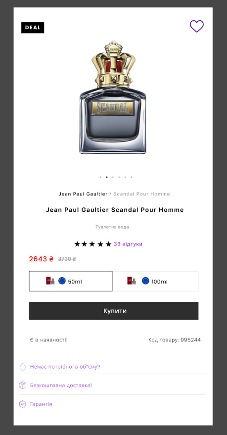
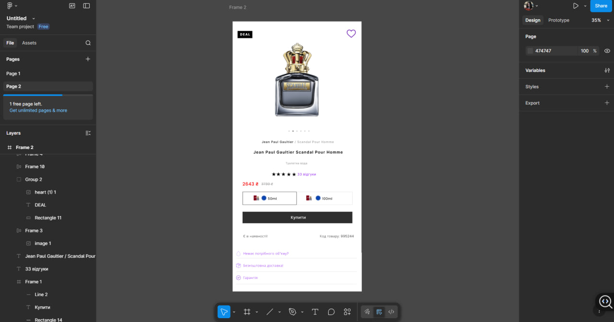

# ПЗ-9 Функція Auto layot у Figma. Створення картки товару (послуги).

## Тема заняття
Створення картки товару використовуючи функцію Auto layot.
## Хід роботи

### 1. Завдання 
Створити малу картку товару,  використовуючи функцію Auto layout у Figma . При оформленні використати відповідне зображення , текст, значки

**1.1 Опис роботи**

Під час виконання цієї практичної роботи я створила картку товару у Figma з використанням функції Auto Layout. За основу я взяла товар — парфум Jean Paul Gaultier Scandal Pour Homme. У верхній частині картки розмістила зображення товару, додала позначку DEAL та іконку «обране» у вигляді серця.

Нижче я розмістила назву бренду й товару, тип продукту, рейтинг у вигляді зірок та кількість відгуків. Для цього використала текстові блоки з різними розмірами й кольорами шрифту, щоб зберегти візуальну ієрархію. 

За допомогою Auto Layout я налаштувала внутрішні відступи, відстані між елементами та вирівнювання, щоб усі компоненти автоматично підлаштовувалися при зміні тексту або розміру блоків. . Внизу розмістила інформацію про наявність товару, код товару та додаткові переваги — безкоштовну доставку й гарантію.

**1.3. Результат**

## Висновки
Під час виконання практичного завдання я:
- створила картку товару з використанням Auto Layout;
- додала зображення, текст,кнопки та значки;
- налаштувала відступи, інтервали й вирівнювання між елементами;

Ця робота навчила мене:
- працювати з функцією Auto Layout у Figma;
- створювати адаптивні картки товарів;
- правильно розміщувати зображення, текст і кнопки в одному блоці.