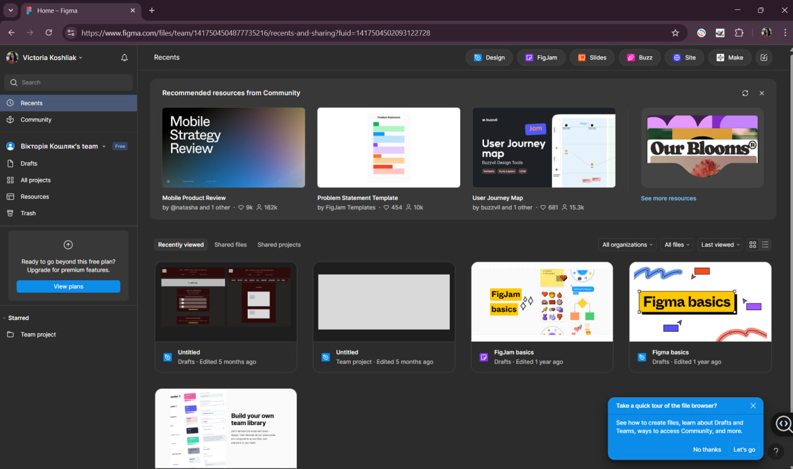

# ПЗ-1 Огляд сервісів для прототипування

## Тема заняття
ОГЛЯД І ПОРІВНЯЛЬНА ХАРАКТЕРИСТИКА СЕРВІСІВ ДЛЯ ПРОЕКТУВАННЯ КОРИСТУВАЛЬНИЦЬКИХ ІНТЕРФЕЙСІВ

## Хід роботи

### 1. Реєстрація у Figma
Я перейшла на офіційний сайт Figma та створила обліковий запис, вказавши своє ім'я та прізвище.
Після реєстрації я увійшла у свій акаунт.

**1. Інтерфейс Figma із залогіненим акаунтом**

### 2. Встановлення десктопної версії
Я завантажила десктопну версію Figma для Windows із офыцыйного сайту Figma для Windows 
Після встановлення я увійшла під своїм акаунтом і перевірила роботу програми.

**2. Значок Figma на робочому столі**

## Висновки
Під час виконання практичного завдання я:
- створила обліковий запис у Figma;
- ознайомилася з інтерфейсом онлайн та десктопної версії;
- навчилася входити до свого акаунта та орієнтуватися у базових елементах робочого середовища.

Ця робота навчила мене:
- створювати власний обліковий запис у сервісі Figma;
- орієнтуватися в інтерфейсі веб- та десктопної версій програми;
- розуміти основні можливості Figma для дизайну та прототипування інтерфейсів;
- працювати з візуальними елементами та підготовлювати середовище для створення макетів.
